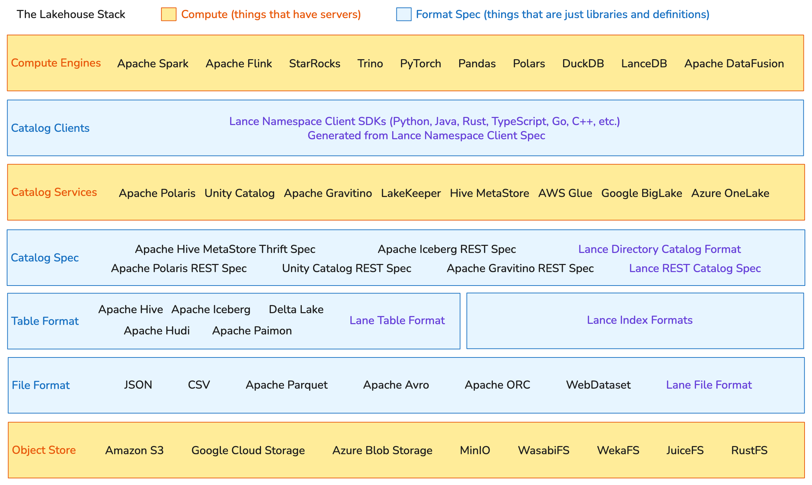

# Lance Lakehouse Format Specification

Lance is a lakehouse format designed as a stack of interoperating specifications instead of a single file or metadata layout. The storage-facing layers are the file format, table format, index formats, and catalog specifications, with a unified namespace interface sitting above them.

## Architecture Overview

Modern lakehouses are built from cooperating layers. Lance keeps those layers intentionally decoupled so that the file format, table metadata, indices, and catalogs can evolve independently without forcing lock-in across the stack.

At a high level:

- The **file format** stores column data in large random-access-friendly pages and avoids row groups.
- The **table format** manages fragments, manifests, deletions, schema evolution, and ACID commits.
- The **index formats** define redundant search structures such as scalar, vector, full-text, and system indices.
- The **catalog specs** define how tables are discovered, registered, and coordinated across engines and services.
- The **namespace client spec** provides a unified interface for engines to interact with any catalog implementation.

The layers are designed so that only table readers, table writers, and index readers or writers need to know the on-disk Lance file layout.

## Design Themes

### File Format

The Lance file format is optimized for cloud object storage and highly selective reads. It avoids Parquet-style row groups, uses structural encodings that support efficient random access, and keeps statistics and search structures out of the file format so those concerns can evolve as independent indices.

### Table Format

The Lance table format stores data in two dimensions: rows are grouped into fragments, and each fragment can contain multiple data files that each contribute a subset of columns. This makes column additions and backfills metadata-heavy instead of rewrite-heavy, which is especially useful for feature engineering and embedding workflows.

### Index Formats

Indices are first-class table objects. Lance tables define how indices are discovered, versioned, and coordinated transactionally, while the index formats themselves remain decoupled from both the file encoding and the table manifest structure.

### Catalog Specs

Lance provides storage-native and service-oriented catalog options. The [Directory Catalog](catalog/dir/index.md) supports zero-infrastructure deployments directly on object stores, while the [REST Catalog](catalog/rest/index.md) standardizes enterprise-facing APIs and can act as an external manifest store.

### Namespace Client Spec

The [Namespace Client Spec](namespace/index.md) provides a unified interface for engines to interact with any catalog implementation, across both Lance native catalog specs and third-party catalog systems, in any programming language. This abstraction allows applications to switch between directory-based, REST-based, or third-party catalogs without changing their code.

## Specifications

The main specification entry points are:

1. **File Format**: [Lance file format](file/index.md)
2. **Table Format**: [Lance table format](table/index.md)
3. **Index Formats**: [Scalar, vector, and system index formats](index/index.md)
4. **Catalog Specs**: [Directory and REST catalog specs](catalog/index.md)
5. **Namespace Client Spec**: [Lance namespace interface](namespace/index.md)
