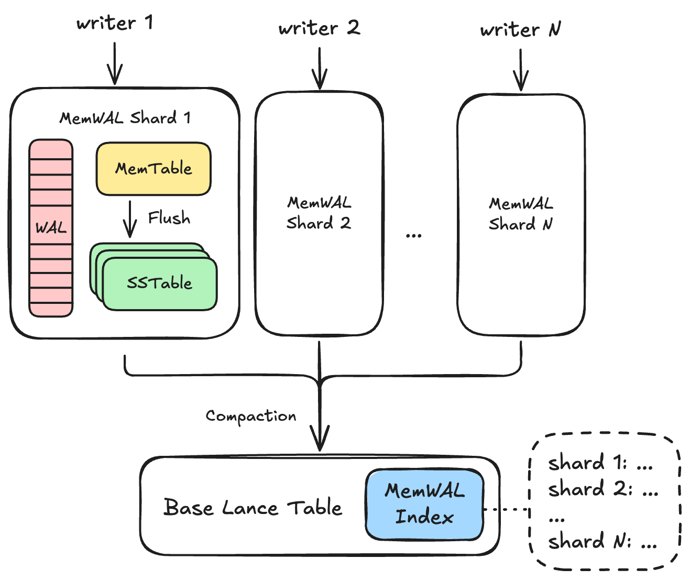
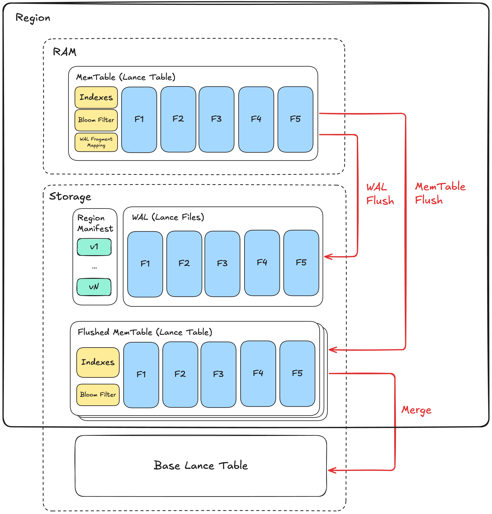

# MemTable & WAL Specification (Experimental)

Lance MemTable & WAL (MemWAL) specification describes a Log-Structured-Merge (LSM) tree architecture for Lance tables, enabling high-performance streaming write workloads while maintaining indexed read performance for key workloads including
scan, point lookup, vector search and full-text search.

## Overall Architecture



A Lance table is called the **base table** in this document.
The base table may have an [unenforced primary key](index.md#unenforced-primary-key) in its schema.
Primary keys are required for primary-key lookups and last-write-wins upsert semantics.
Append-only MemWAL tables may omit a primary key.

MemWAL adds a set of shards on top of the base table.
Writers append to shards.
Each shard keeps recent data in an in-memory MemTable, persists writes to a per-shard WAL, flushes MemTables as small Lance datasets, and later merges those flushed generations into the base table.

The base table manifest contains one MemWAL system index entry named `__lance_mem_wal`.
This index stores MemWAL configuration and global progress metadata inline in `IndexMetadata.index_details`.
Each shard's own manifest remains authoritative for shard-local mutable state.

### MemWAL Shard

A **MemWAL shard** is the unit of horizontal write scaling.
Each shard has exactly one active writer epoch at a time.
Writers claim a shard, append WAL entries, update the in-memory MemTable, and publish flushed MemTable generations by updating the shard manifest.

For primary-key tables, all rows for the same primary key must map to the same shard.
If one primary key can appear in multiple shards, asynchronous merge order between shards can make an older row overwrite a newer row.
Append-only tables without a primary key do not rely on last-write-wins conflict resolution and may use any deterministic shard assignment suitable for the workload.

### MemWAL Index

The MemWAL index is a system index entry on the base table.
It has `name = "__lance_mem_wal"`, no indexed fields, and no index files.
`IndexMetadata.files` is `None`.
All MemWAL index data is stored in the `MemWalIndexDetails` protobuf message in `IndexMetadata.index_details`.

The index stores:

- **Configuration**: `sharding_specs`, `maintained_indexes`, and `writer_config_defaults`.
- **Merge progress**: `merged_generations`, the last generation merged into the base table for each shard.
- **Index catchup progress**: `index_catchup`, the merged generation covered by each base-table index.
- **Shard snapshots**: optional point-in-time snapshot fields for read optimization.

Shard snapshots are not authoritative.
Readers that need the latest shard set list `_mem_wal/` and read each shard's latest manifest.

## Shard Architecture



Within a shard, writes first enter an in-memory **MemTable** and are durably appended to the shard **write-ahead log (WAL)**.
The MemTable is periodically **flushed** to storage as a Lance dataset.
Flushed MemTables are asynchronously **merged** into the base table.

### MemTable

A MemTable holds rows inserted into a shard before those rows are flushed to storage.
It serves two purposes:

1. It buffers data and per-MemTable indexes before a flushed generation is written.
2. It lets readers access data that has not been flushed yet when strong consistency is required.

The storage format does not prescribe the in-memory MemTable layout.
Conceptually, a MemTable is an append log of Arrow record batches.
Later appends have larger in-memory row positions.
For primary-key tables, in-memory reads use the largest visible row position as the newest row for a key.

### MemTable Generation

Each MemTable has a monotonically increasing generation number starting from 1.
When generation `N` is flushed and discarded, the next MemTable uses generation `N + 1`.

Generation numbers order data freshness within one shard:

- Base table data has generation 0.
- Higher MemWAL generations are newer.
- Within the active in-memory generation, higher row positions are newer.
- Within a flushed generation, flush-time deletion vectors hide older duplicate primary-key rows, so readers see at most the newest row for each primary key.

## WAL

The WAL is the durable append log for a shard.
Every durable WAL append creates one **WAL entry**.

### WAL Entry Positions

WAL entry positions are 1-based.
The first data entry is position 1.
Position 0 is reserved as the sentinel value meaning no WAL entry has been covered.

Writers append WAL entries in increasing position order.
If entry `N` is not fully written, entry `N + 1` must not exist.
Recovery replays from `replay_after_wal_entry_position + 1`.

### WAL Entry Format

Each WAL entry is an Apache Arrow IPC stream file.
The Arrow schema metadata includes:

- `writer_epoch`: decimal string containing the writer epoch that created the entry.
- `fence_sentinel`: optional marker for a data-less fence sentinel entry.

A normal WAL entry contains one or more record batches.
A fence sentinel entry contains no batches and is skipped during replay.
Sentinels are used so an older writer collides on the next WAL position and discovers that it has been fenced.

### WAL Storage Layout

WAL entries live under `_mem_wal/{shard_id}/wal/`.
Filenames use bit-reversed 64-bit binary names with the `.arrow` suffix:

```text
_mem_wal/{shard_id}/wal/{bit_reversed_position}.arrow
```

The bit-reversal spreads sequential positions across object-store keyspace.
For example, position 5 is encoded as:

```text
1010000000000000000000000000000000000000000000000000000000000000.arrow
```

## Flushed MemTable

A flushed MemTable is a persisted MemTable generation.
It is stored as a Lance dataset under its shard directory.

!!! note
    This structure is similar to a sorted string table in other LSM implementations, but MemWAL flushed generations are not sorted by key.

### Flushed MemTable Storage Layout

Generation `i` is flushed to:

```text
_mem_wal/{shard_id}/{random8}_gen_{i}/
```

`{random8}` is an 8-character random hex value generated for each flush attempt.
If a flush attempt fails, a retry writes a different directory instead of reusing a partially written one.
The shard manifest records the successful directory name in `flushed_generations.path`.

The generation directory is a standard Lance dataset written with the base table's data storage version.
Each flushed generation is written as one fragment.
Additional MemWAL sidecars may be present:

```text
{random8}_gen_{i}/
├── _versions/
│   └── {version}.manifest
├── _deletions/                         # Present when within-generation dedup deletes rows
├── _indices/                           # Present when maintained user indexes are built
│   └── {index_uuid}/
├── _pk_index/                          # Primary-key sidecar BTree, not a manifest index
└── bloom_filter.bin                    # Primary-key bloom filter
```

The exact Lance dataset internals follow the [Lance table storage layout](layout.md).

### Flushed Row Order

Flushed MemTable rows are written in forward insert order.
Physical row offsets increase with write time.
For a duplicate primary key within one flushed generation, the newest row has the largest physical offset.

Primary-key flushed generations use a deletion vector to expose last-write-wins semantics.
During flush, the writer scans rows in forward order, keeps the last occurrence of each primary key, and marks all earlier duplicate offsets deleted.
The deletion vector is attached to fragment 0 in the generation manifest.

Append-only flushed generations without a primary key do not perform primary-key deduplication and retain every row.

### Tombstone Rows

Delete operations are represented as rows with the internal `_tombstone` column.
Tombstone rows follow the same forward row ordering and deletion-vector rules as ordinary rows.
If the newest row for a primary key is a tombstone, the deletion vector keeps that tombstone row and hides older rows for the key.
Read planning then filters `_tombstone = false`, so the key is absent from query results.

### Flushed Primary-Key Sidecars

Primary-key MemTables maintain an implicit BTree for primary-key deduplication, independent of `maintained_indexes`.
When a primary-key MemTable is flushed, the flushed generation writes two primary-key sidecars:

- `bloom_filter.bin` stores the generation's primary-key bloom filter and lets point lookups skip generations that cannot contain the queried key.
- `_pk_index/` stores a standalone BTree over primary-key values to forward row ids.

The `_pk_index/` sidecar is not a maintained user index, is not registered in the generation manifest, and has no manifest UUID.
Its identity is its immutable generation path.
Readers open it directly from `{generation_path}/_pk_index`.

The `_pk_index/` directory is a Lance scalar BTree index store:

```text
_pk_index/
├── page_data.lance
└── page_lookup.lance
```

Readers load this directory as a BTree index using `BTreeIndexDetails` with default parameters.
The primary-key index type is the Arrow type of the primary-key column for a single-column primary key, or `Binary` for a composite primary key.

The `page_lookup.lance` file has the following schema:

| Column       | Type                    | Nullable | Description                                    |
|--------------|-------------------------|----------|------------------------------------------------|
| `min`        | {PrimaryKeyIndexType}   | true     | Minimum primary-key index value in the page    |
| `max`        | {PrimaryKeyIndexType}   | true     | Maximum primary-key index value in the page    |
| `null_count` | UInt32                  | false    | Number of null values in the page              |
| `page_idx`   | UInt32                  | false    | Page number pointing into `page_data.lance`    |

The `page_data.lance` file has the following schema:

| Column   | Type                  | Nullable | Description                                                       |
|----------|-----------------------|----------|-------------------------------------------------------------------|
| `values` | {PrimaryKeyIndexType} | true     | Sorted primary-key index values                                   |
| `ids`    | UInt64                | false    | Forward row ids corresponding to each primary-key index value     |

For a single-column primary key, the indexed value stores the primary-key scalar directly.
For a composite primary key, the indexed value stores an order-preserving binary tuple encoding of all primary-key columns in primary-key column order.
Each tuple column is encoded as:

- `0x00` for null.
- `0x01` followed by the non-null value encoding otherwise.

Supported non-null value encodings are:

- Signed integers and date values: sign-flipped 8-byte big-endian integer bytes.
- Unsigned integers: 8-byte big-endian unsigned integer bytes.
- Boolean: one byte, `0x00` for false and `0x01` for true.
- UTF-8 and binary values: raw bytes, with each `0x00` byte escaped as `0x00 0xff`, followed by a `0x00 0x00` terminator.

This encoding is injective and preserves primary-key tuple ordering under lexicographic byte comparison.
Composite primary-key columns must use one of the supported encodings above.

The sidecar row ids are in the same forward row-position space as the data files, deletion vector, and maintained user indexes.
The sidecar is used for cross-generation membership and block-list checks.
It is not used to choose the newest row inside the same flushed generation; the deletion vector has already hidden older same-generation duplicates.

### Maintained User Indexes

When the MemWAL index lists `maintained_indexes`, flush may build matching indexes inside the flushed generation.
These index files live in the generation's `_indices/{index_uuid}/` directory and are recorded in the generation manifest.
The implicit primary-key BTree sidecar is not included in `maintained_indexes` and does not live under `_indices/`.

These indexes use the same row-position space as the forward-written data files.
If the generation has a primary key, the generation deletion vector masks stale duplicate rows for indexed reads as well.

### Merging Flushed Generations

Flushed generations are merged into the base table in ascending generation order within each shard.
Lower generation numbers are older and must merge before higher generation numbers.
The base table merge uses merge-insert semantics so newer rows overwrite older rows for the same primary key.

## Shard Manifest

Each shard has a versioned manifest.
The latest shard manifest is the source of truth for shard-local state.

### Shard Manifest Contents

The manifest contains:

- **Identity**: `shard_id`, `shard_spec_id`, and `shard_field_entries`.
- **Fencing state**: `writer_epoch`.
- **WAL pointers**: `replay_after_wal_entry_position` and `wal_entry_position_last_seen`.
- **Generation state**: `current_generation` and `flushed_generations`.
- **Lifecycle state**: `status`, either `ACTIVE` or `SEALED`.

`shard_field_entries` stores computed shard field values as raw Arrow scalar bytes keyed by `ShardingField.field_id`.
The matching `ShardingField.result_type` determines how to decode each value.
For example, `int32` values are four little-endian bytes and `utf8` values are raw UTF-8 bytes.

`replay_after_wal_entry_position` is the most recent 1-based WAL position covered by a flushed generation.
The default value 0 means no WAL entry has been covered and recovery starts at position 1.

`wal_entry_position_last_seen` is a best-effort hint for the most recent WAL position observed at manifest update time.
It is not authoritative because it is not updated on every WAL write.
Recovery must still probe or list WAL files to find the actual tail.

`status = SEALED` marks a reversible in-flight drop-table operation.
Sealed shards refuse new writer claims.

The manifest is serialized as the `ShardManifest` protobuf message.

<details>
<summary>ShardManifest protobuf message</summary>

```protobuf
%%% mem_wal.message.ShardManifest %%%
```

</details>

### Shard Manifest Versioning

Manifest versions start at 1.
Each update writes a new immutable protobuf file:

```text
_mem_wal/{shard_id}/manifest/{bit_reversed_version}.binpb
```

Writers use put-if-not-exists or atomic rename, depending on storage support.
If two processes race to write the same next version, one wins and the other reloads and retries.

After a successful version write, the writer best-effort updates:

```json
{"version": <new_version>}
```

in:

```text
_mem_wal/{shard_id}/manifest/version_hint.json
```

Readers use `version_hint.json` as a starting point and then probe subsequent versions until a version is missing.
The latest manifest is the last existing version.

## MemWAL Index Details

The MemWAL index is stored inline in the base table's `IndexMetadata`.
It is a system index with no file directory.
The `index_details` field contains a `MemWalIndexDetails` protobuf message.

Important fields:

- `sharding_specs`: sharding configuration used by writers and shard pruning.
- `maintained_indexes`: names of base-table indexes to maintain in MemTables and flushed generations.
- `writer_config_defaults`: string map of default writer configuration values persisted for all writers.
- `merged_generations`: per-shard merge progress, updated atomically with base-table merge commits.
- `index_catchup`: per-index coverage progress after data has merged to the base table.
- `snapshot_ts_millis`, `num_shards`, and `inline_snapshots`: optional shard snapshot fields for read optimization.

If a shard is absent from `index_catchup` for an index, that index is assumed to be fully caught up for the shard.

Shard snapshots, when present, use the following Lance file schema:

| Column                     | Type                         | Nullable | Description                                            |
|----------------------------|------------------------------|----------|--------------------------------------------------------|
| `shard_id`                 | Utf8                         | false    | Shard UUID string                                      |
| `shard_spec_id`            | UInt32                       | false    | Sharding spec that produced the shard                  |
| `shard_field_{field_id}`   | `ShardingField.result_type`  | false    | Computed shard field value for the given sharding field |

The MemWAL index data is stored inline.
Readers discover the latest shard set by listing `_mem_wal/` shard directories and reading shard manifests.

<details>
<summary>MemWalIndexDetails protobuf message</summary>

```protobuf
%%% mem_wal.message.MemWalIndexDetails %%%
```

</details>

## Sharding

A **ShardingSpec** defines how rows map to shards.
Each spec has a positive `spec_id` and one or more `ShardingField` entries.
Each shard manifest records the `shard_spec_id` and the computed shard field values for that shard.
`spec_id = 0` means the shard was manually created and is not governed by a sharding spec.

Each `ShardingField` contains:

- `field_id`: stable identifier for the computed shard field.
- `source_ids`: field IDs of source columns in the Lance schema.
- `transform`: well-known transform name, when using built-in transform evaluation.
- `expression`: reserved custom expression text, mutually exclusive with `transform`.
- `result_type`: Arrow type name for the computed value.
- `parameters`: transform-specific string parameters.

The supported built-in transforms are:

- `unsharded`: takes no source columns, always returns `int32` value 0, and creates one shard.
- `bucket`: takes one source column and `num_buckets`, hashes the value, and returns an `int32` bucket id in `[0, num_buckets)`.
- `identity`: takes one source column and returns the raw scalar value as the shard value.

`bucket` computes a deterministic 32-bit hash with seed 0 and then computes:

```text
(hash & i32::MAX) % num_buckets
```

`num_buckets` must be in `[1, 1024]`.
Null bucket values hash to 0 and therefore map to bucket 0.
See [Appendix 3: Bucket Hashing](#appendix-3-bucket-hashing) for the exact hash algorithm and test vectors.

The `bucket` transform supports scalar boolean, integer, floating-point, date32, time, timestamp, utf8, and large_utf8 source types.
The `identity` transform supports scalar boolean, integer, utf8, and large_utf8 source types.

The `year`, `month`, `day`, `hour`, `multi_bucket`, and `truncate` transform names are not supported MemWAL sharding transforms and must not be used in `ShardingSpec.transform`.

## Storage Layout

The MemWAL storage layout is:

```text
{table_path}/
├── _versions/
│   └── ...                              # Base table manifests, including __lance_mem_wal index metadata
├── _indices/
│   └── ...                              # Ordinary base table index files; MemWAL index has no files
└── _mem_wal/
    └── {shard_id}/
        ├── manifest/
        │   ├── {bit_reversed_version}.binpb
        │   └── version_hint.json
        ├── wal/
        │   ├── {bit_reversed_position}.arrow
        │   └── ...
        └── {random8}_gen_{generation}/
            ├── _versions/
            │   └── {version}.manifest
            ├── _deletions/
            ├── _indices/
            │   └── {index_uuid}/
            ├── _pk_index/
            └── bloom_filter.bin
```

Some flushed-generation subdirectories are conditional.
For example, `_deletions/` is present only when the generation manifest references a deletion vector, `_indices/` is present only when maintained user indexes are built, and `_pk_index/` plus `bloom_filter.bin` are meaningful for primary-key tables.

## Implementation Expectation

This document specifies the storage layout and observable reader and writer invariants.
Implementations may choose different in-memory structures, buffering policies, background scheduling, and query execution plans.

An implementation is compatible when it:

1. Writes WAL entries, shard manifests, flushed generations, and MemWAL index metadata using the documented layout.
2. Preserves WAL position, writer fencing, and manifest versioning invariants.
3. Exposes last-write-wins semantics for primary-key tables.
4. Preserves append-only semantics for tables without primary keys.
5. Maintains generation ordering when merging flushed MemTables into the base table.

## Writer Expectations

A writer operates on one shard and is responsible for:

1. Claiming the shard with epoch-based fencing.
2. Appending WAL entries in sequential 1-based positions.
3. Maintaining in-memory MemTable state.
4. Flushing MemTable generations to Lance datasets.
5. Updating the shard manifest after a generation is durably flushed.

### Writer Fencing

Writers use `writer_epoch` to enforce single-writer semantics per shard.

To claim a shard:

1. Load the latest shard manifest.
2. Verify the shard is `ACTIVE`.
3. Increment `writer_epoch`.
4. Atomically write a new manifest version.
5. If the manifest write loses a race, reload and retry.

Before a manifest update, a writer verifies its local epoch is still current:

- If `local_writer_epoch == stored_writer_epoch`, the writer may proceed.
- If `local_writer_epoch < stored_writer_epoch`, the writer has been fenced and must abort.

WAL append conflicts also detect fencing.
If an older writer collides with a newer writer's WAL entry at the same position, it reloads the manifest and observes the higher epoch.
Fence sentinel entries make this collision path explicit without storing data batches.

## Background Job Expectations

Background jobs merge flushed generations into the base table and remove obsolete shard data.

### MemTable Merger

Flushed MemTables must merge into the base table in ascending generation order within each shard.
The merge uses Lance merge-insert semantics and updates `merged_generations[shard_id]` atomically with the base-table commit.

On commit conflict, a merger reloads the conflicting base-table version:

- If the committed `merged_generations[shard_id]` is already greater than or equal to the generation being merged, the merger skips that generation.
- Otherwise, the merger retries from the latest base-table version.

### Garbage Collector

The garbage collector may remove obsolete flushed generations after:

1. The generation has been merged to the base table.
2. Every maintained index has caught up to cover the merged generation, or the generation is no longer needed for indexed reads.
3. No retained base-table version needs the generation for time travel or consistency.

!!! warning
    Deleting WAL files can weaken writer fencing.

    Fencing detects a stalled writer when its put-if-not-exists for the next WAL entry collides with a newer writer's entry at the same position.
    If garbage collection has removed that WAL file, the stalled writer may write into empty space with an old `writer_epoch`.
    Implementations that garbage collect WAL files must compensate by re-checking fence state after WAL writes, partitioning WAL positions by epoch, or otherwise preventing stale writers from landing at positions that have been garbage collected.

## Reader Expectations

### LSM Tree Merging Read

For primary-key tables, readers merge rows from the base table, flushed MemTables, and optionally in-memory MemTables by primary key.
The newest row wins.

Freshness ordering within one shard is:

1. Higher generation wins.
2. Within the active in-memory generation, higher row position wins.
3. Within a flushed generation, the generation's deletion vector has already hidden older duplicate primary-key rows.

The base table has generation 0.
MemWAL generations are positive.
This ordering applies only to sources selected for the same read plan.
Readers must not include a flushed generation that is already covered by the base table according to `merged_generations[shard_id]`, because otherwise the positive MemWAL generation would incorrectly outrank base-table rows during deduplication.
Rows from different shards do not need primary-key deduplication if the sharding spec guarantees that each primary key maps to exactly one shard.

Append-only tables without a primary key do not perform primary-key deduplication.
Rows from all selected sources are distinct appended rows.

### Tombstones

Readers must treat `_tombstone = true` rows as delete markers.
In flushed generations, deletion vectors first resolve same-generation duplicate primary keys.
Then query planning filters tombstone rows from user-visible results.
In active in-memory MemTables, the newest visible row position for a primary key wins; if that row is a tombstone, the key is absent.

### Reader Consistency

Reader consistency depends on:

1. Whether the reader can access active in-memory MemTables.
2. Whether shard metadata comes from latest shard manifests or from an older MemWAL index snapshot.

Strong consistency requires active in-memory MemTable access for relevant shards and direct reads of latest shard manifests.
Otherwise, reads are eventually consistent because unflushed data or newly-created shards may be absent from the read plan.

Reading a stale MemWAL index snapshot does not corrupt last-write-wins ordering, but it can reduce freshness:

- If a merged flushed generation is still listed, readers must skip it when `generation <= merged_generations[shard_id]`.
  For primary-key tables, including it would let an older flushed row outrank newer base-table contents because MemWAL generations are positive and the base table is modeled as generation 0.
  For append-only tables, including it would return the same append twice.
- If a garbage-collected flushed generation is still listed, readers may skip it after failing to open it because its data must already be in the base table or be filtered out by `merged_generations`.
- If a newly flushed generation is not listed, the read is consistent with the older snapshot but may miss fresher data.

Readers that require latest shard membership should list `_mem_wal/` and read shard manifests instead of relying only on snapshots.

### Query Planning

A query planner collects sources from:

1. The base table.
2. Flushed MemTables that are not yet safely replaceable by base-table indexed reads.
3. Active in-memory MemTables, when available and required by the requested consistency level.

Each source is tagged with its shard and generation.
For primary-key reads, the planner applies LSM deduplication across selected sources.
For append-only reads, the planner concatenates selected sources without primary-key deduplication.

Bloom filters and `_pk_index/` sidecars help prune flushed generations during point lookups and cross-generation deduplication.

### Shard Pruning

When sharding specs are available, the planner evaluates query predicates against shard fields and skips shards whose computed shard values cannot match.

For example, with `bucket(user_id, 10)` and predicate `user_id = 123`:

1. Compute the bucket id for `123`.
2. Scan only shards whose manifest has the same computed bucket value.
3. Skip all other bucket shards.

### Indexed Read Plan

When data is merged from a flushed MemTable into the base table, base-table indexes may lag behind the data commit.
`index_catchup` records which merged generation each base-table index covers.

If an indexed query needs index `I` and `I` has only caught up to generation `G` while `merged_generations[shard_id]` is higher, the planner should read the gap from flushed-generation indexes instead of scanning unindexed base-table rows.
Once index `I` catches up, the planner can use the base-table index for those merged rows.

## Appendices

### Appendix 1: Writer Fencing Example

Initial shard manifest:

```text
version: 1
writer_epoch: 5
replay_after_wal_entry_position: 10
wal_entry_position_last_seen: 12
status: ACTIVE
```

Writer A loads version 1, claims epoch 6, and writes manifest version 2.
It appends WAL entries 13, 14, and 15 with `writer_epoch = 6`.

Writer B then loads version 2, claims epoch 7, and writes manifest version 3.
It appends WAL entries 16 and 17 with `writer_epoch = 7`.

When Writer A later tries to flush or update the shard manifest, it reloads the manifest and sees stored epoch 7 while its local epoch is 6.
Writer A is fenced and must abort.

Recovery starts from `replay_after_wal_entry_position + 1`, which is entry 11.
Entries 13, 14, 15, 16, and 17 are valid replay inputs because they were written by epochs that were valid at write time and are not greater than the current shard epoch.

### Appendix 2: Concurrent Merger Example

Initial state:

```text
MemWAL index:
  merged_generations: {shard: 5}

Shard manifest:
  current_generation: 8
  flushed_generations:
    - generation: 6, path: "abc12345_gen_6"
    - generation: 7, path: "def67890_gen_7"
```

Two mergers both try to merge generation 6.
Merger A commits first and updates `merged_generations[shard]` to 6 in the same base-table commit as the data.
Merger B then hits a commit conflict, reloads the latest MemWAL index, sees `merged_generations[shard] >= 6`, skips generation 6, and continues with generation 7.

The MemWAL index is the authoritative merge-progress record because it is committed atomically with the base-table data changes.

### Appendix 3: Bucket Hashing

The bucket transform hash uses 32-bit wrapping arithmetic with these mixing functions.
Right shifts in `fmix` are logical shifts of the `u32` bit pattern.

```text
mix_k1(k) = rotl32(k * 0xcc9e2d51, 15) * 0x1b873593
mix_h1(h, k) = rotl32(h ^ k, 13) * 5 + 0xe6546b64
fmix(h, len) =
    h = h ^ len
    h = (h ^ (h >> 16)) * 0x85ebca6b
    h = (h ^ (h >> 13)) * 0xc2b2ae35
    h ^ (h >> 16)
```

Signed and unsigned casts use two's-complement wrapping.
Values are normalized and hashed as follows:

- `bool`: `false` as `0`, `true` as `1`, then `hash_i32`.
- `int8`, `int16`, `int32`, `uint8`, `uint16`, `uint32`, `date32`, `time32`: cast to `i32`, then `hash_i32`.
- `int64`, `uint64`, `timestamp`, `time64`: cast to `i64`, then `hash_i64`.
- `float32`: `-0.0` and `+0.0` normalize to bits `0`; all NaNs normalize to `0x7fc00000`; other values use IEEE 754 bits cast to `i32`, then `hash_i32`.
- `float64`: `-0.0` and `+0.0` normalize to bits `0`; all NaNs normalize to `0x7ff8000000000000`; other values use IEEE 754 bits cast to `i64`, then `hash_i64`.
- `utf8` and `large_utf8`: hash the UTF-8 bytes with `hash_bytes`.

The helper hashes are:

```text
hash_i32(v) = fmix(mix_h1(0, mix_k1(v)), 4)

hash_i64(v) =
    low = low 32 bits of v as i32
    high = high 32 bits of v as i32
    fmix(mix_h1(mix_h1(0, mix_k1(low)), mix_k1(high)), 8)

hash_bytes(bytes) =
    h = 0
    for each complete 4-byte little-endian chunk:
        h = mix_h1(h, mix_k1(chunk_as_i32))
    for each remaining byte:
        h = mix_h1(h, mix_k1(sign_extend_i8(byte)))
    fmix(h, byte_length)
```

Test vectors for `num_buckets = 8`:

- `int32` or `date32`: `1 -> 2`, `2 -> 7`, `null -> 0`, `3 -> 1`.
- `utf8`: `"a" -> 1`, `"b" -> 5`, `null -> 0`.
- `bool`: `true -> 2`.
- `float32`: `1.25 -> 0`.
- `float64`: `1.25 -> 0`.
