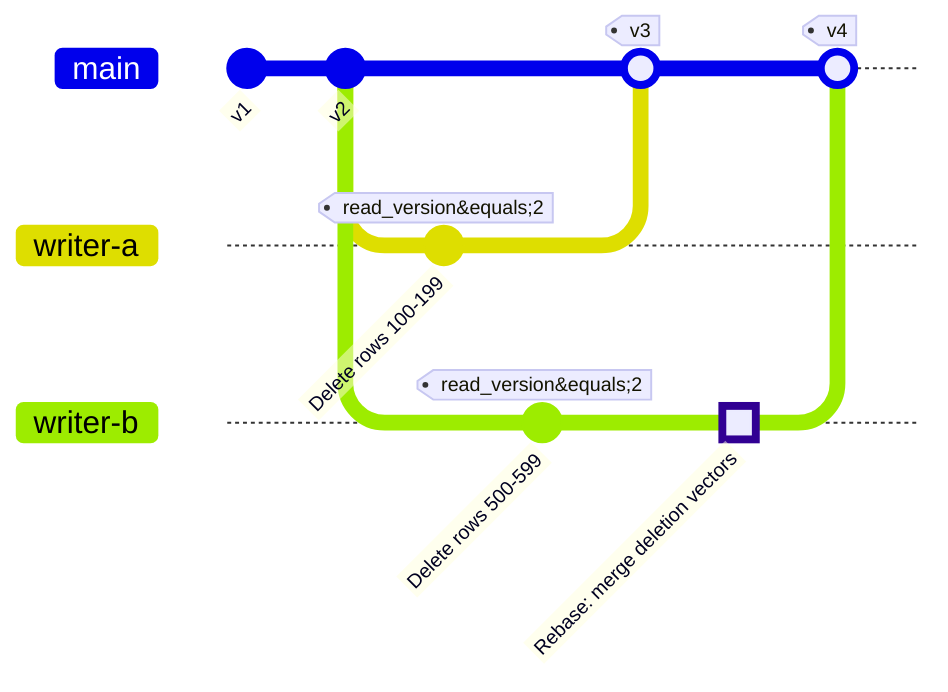
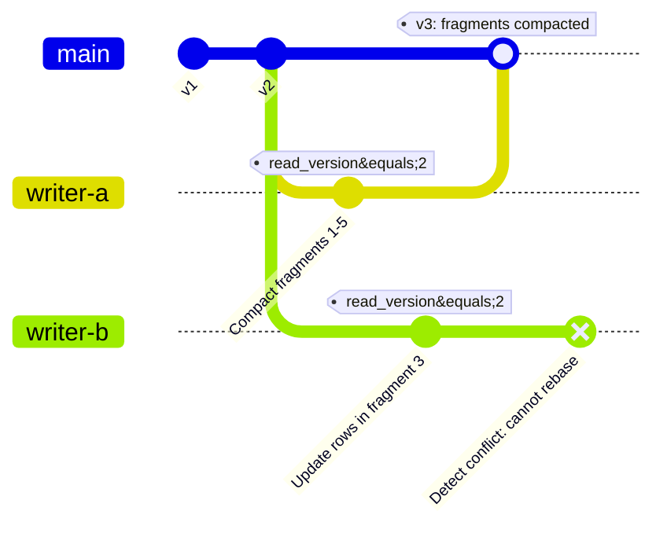
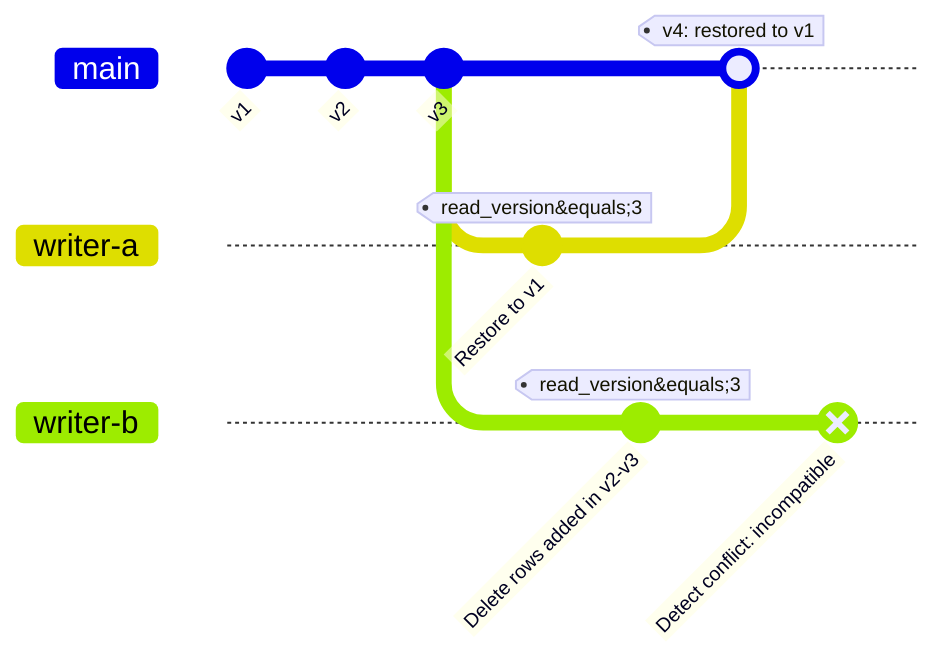

# Transaction Specification

## Transaction Overview

Lance implements Multi-Version Concurrency Control (MVCC) to provide ACID transaction guarantees for concurrent readers and writers.
Each commit creates a new immutable table version through atomic storage operations.
All table versions form a serializable history, enabling features such as time travel and schema evolution.

Transactions are the fundamental unit of change in Lance.
A transaction describes a set of modifications to be applied atomically to create a new table version.
The transaction model supports concurrent writes through optimistic concurrency control with automatic conflict resolution.

## Commit Protocol

### Storage Primitives

Lance commits rely on atomic write operations provided by the underlying object store:

- **rename-if-not-exists**: Atomically rename a file only if the target does not exist
- **put-if-not-exists**: Atomically write a file only if it does not already exist (also known as PUT-IF-NONE-MATCH or conditional PUT)

These primitives guarantee that exactly one writer succeeds when multiple writers attempt to create the same manifest file concurrently.

### Manifest Naming Schemes

Lance supports two manifest naming schemes:

- **V1**: `{version}.manifest` - Monotonically increasing version numbers (e.g., `1.manifest`, `2.manifest`)
- **V2**: `{u64::MAX - version:020}.manifest` - Reverse-sorted lexicographic ordering (e.g., `18446744073709551614.manifest` for version 1)

The V2 scheme enables efficient discovery of the latest version through lexicographic object listing.

### Transaction Files

Transaction files store the serialized transaction protobuf message for each commit attempt.
These files serve two purposes:

1. Enable manifest reconstruction during commit retries when concurrent transactions have been committed
2. Support conflict detection by describing the operation performed

### Commit Algorithm

The commit process attempts to atomically write a new manifest file using the storage primitives described above.
When concurrent writers conflict, the system loads transaction files to detect conflicts and attempts to rebase the transaction if possible.
If the atomic commit fails, the process retries with updated transaction state.
For detailed conflict detection and resolution mechanisms, see the [Conflict Resolution](#conflict-resolution) section.

## Transaction Types

The authoritative specification for transaction types is defined in [`protos/transaction.proto`](https://github.com/lancedb/lance/blob/main/protos/transaction.proto).

Each transaction contains a `read_version` field indicating the table version from which the transaction was built,
a `uuid` field uniquely identifying the transaction, and an `operation` field specifying one of the following transaction types:

In the following section, we will describe each transaction type and its compatibility with other transaction types. This
compatibility is not always bi-directional. We are describing it from the perspective of the operation being committed. For example, we say that an Append is not compatible with an Overwrite which means that if we are trying to commit an Append, and an
Overwrite has already been committed (since we started the Append), then the Append will fail. On the other hand, when describing the
Overwrite operation, we say that it does not conflict with Append. This is because, if we are trying to commit an Overwrite, and an
Append operation has occurred in the meantime, we still allow the Overwrite to proceed.

### Append

Adds new fragments to the table without modifying existing data.
Fragment IDs are not assigned at transaction creation time; they are assigned during manifest construction.

<details>
<summary>Append protobuf message</summary>

```protobuf
%%% proto.message.Append %%%
```

</details>

#### Append Compatibility

The append operation is one of the most common operations and is designed to be compatible with most other operations, even
itself. This is to ensure that multiple writers can append without worry about conflicts. These are the operations
that conflict with append:

- Overwrite
- Restore
- UpdateMemWalState

### Delete

Marks rows as deleted using deletion vectors.
May update fragments (adding deletion vectors) or delete entire fragments.
The `predicate` field stores the deletion condition, enabling conflict detection with concurrent transactions.

<details>
<summary>Delete protobuf message</summary>

```protobuf
%%% proto.message.Delete %%%
```

</details>

#### Delete Compatibility

Delete modifies an existing fragment, so there may be conflicts with other operations on overlapping fragments.
Generally these conflicts are rebaseable or retryable.

These are the operations that conflict with delete:

- Overwrite
- Restore
- UpdateMemWalState

These operations conflict with delete but can be retried:

- Merge (only if there are overlapping fragments)
- Rewrite (only if there are overlapping fragments)
- DataReplacement (only if there are overlapping fragments)

These operations conflict with delete but can potentially be rebased. The deletion
masks from the two operations will be merged. However, if both operations modified
the same rows, then the conflict becomes a retryable conflict.

- Delete
- Update

### Overwrite

Creates or completely overwrites the table with new data, schema, and configuration.

<details>
<summary>Overwrite protobuf message</summary>

```protobuf
%%% proto.message.Overwrite %%%
```

</details>

#### Overwrite Compatibility

An overwrite operation completely overwrites the table. Generally, we do not care what has happened since
the read version.

However, the overwrite does not necessarily rewrite the table config. As a result, we consider the following
to be retryable conflicts:

- UpdateConfig (only if the two operations modify the same config key)
- Overwrite (always)
- UpdateMemWalState (always)

### CreateIndex

Adds, replaces, or removes secondary indices (vector indices, scalar indices, full-text search indices).

<details>
<summary>CreateIndex protobuf message</summary>

```protobuf
%%% proto.message.CreateIndex %%%
```

</details>

#### CreateIndex Compatibility

Indexes record which fragments are covered by the index and we don't require all fragments be covered. As a result, it
is typically ok for an index to be created concurrently with the addition of new fragments. These new fragments will simply
be unindexed.

Updates and deletes are also compatible with index creation. This is because it is ok for an index to refer to deleted rows.
Those results will be filtered out after the index search. If an update occurs then the old value will be filtered out and the
new value will be considered part of the unindexed set.

If two CreateIndex operations are committed concurrently then it is allowed. If the indexes have different names this is no
problem. If the indexes have the same name then the second operation will win and replace the first.

These operations conflict with index creation:

- Overwrite
- Restore
- UpdateMemWalState

Data replacement operations will conflict with index creation if the column being replaced is being indexed. Rewrite operations
will conflict with index creation if the rewritten fragments are covered by the index. This is because an index refers to row
addresses and the rewrite operation changes the row addresses. However, if a fragment reuse index is being used, or if the stable
row ids feature is enable, then the rewrite operation is compatible with index creation. As a result, these are the operations
that are retryable conflicts with index creation:

- Rewrite (only if overlapping fragments, no stable row ids, and no fragment reuse index)
- DataReplacement (only if overlapping fragments and the column being replaced is being indexed)

Some indices are special singleton indices. For example, the fragment reuse index and the mem wal index. If a conflict occurs
between two operations that are modifying the same singleton index, then we must rebase the operation and merge the indexes.
As a result, these are the operations that are rebaseable conflicts with index creation:

- CreateIndex (only if both operations are modifying the same singleton index)

### Rewrite

Reorganizes data without semantic modification.
This includes operations such as compaction, defragmentation, and re-ordering.
Rewrite operations change row addresses, requiring index updates.
New fragment IDs must be reserved via `ReserveFragments` before executing a `Rewrite` transaction.

<details>
<summary>Rewrite protobuf message</summary>

```protobuf
%%% proto.message.Rewrite %%%
```

</details>

#### Rewrite Compatibility

Rewrite operations do not change data but they can materialize deletions and they do replace fragments. As a result,
they can potentially conflict with other operations that modify the fragments being rewritten.

These are the operations that conflict with rewrite:

- Overwrite
- Restore

Rewrite is not compatible with CreateIndex by default because the operation will change the row addresses that the CreateIndex
refers to. However, a fragment reuse index or the stable row ids feature can allow these operations to be compatible.

Several operations modify existing fragments. As a result, they can potentially conflict with Rewrite if they modify
the same fragments. However, Merge is [overly general](#overly-general-operation) and so no conflict detection is possible.
As a result, here are the operations that are retryable conflicts with Rewrite:

- Merge (always)
- DataReplacement (only if overlapping fragments)
- Delete (only if overlapping fragments)
- Update (only if overlapping fragments)
- Rewrite (if overlapping fragments or both carry a fragment reuse index)
- CreateIndex (overlapping fragments and no fragment reuse index or stable row ids)

There is one case where a Rewrite will rebase. This is when the Rewrite operation has a fragment reuse index and there is
a CreateIndex operation that is writing the fragment reuse index. In this case the Rewrite will rebase and update its
fragment reuse index to include the conflicting fragment reuse index.

As a result, these are the operations that are rebaseable conflicts with Rewrite:

- CreateIndex (if the CreateIndex is writing the fragment reuse index and the Rewrite is carrying a fragment reuse index)

### Merge

Adds new columns to the table, modifying the schema.
All fragments must be updated to include the new columns.

<details>
<summary>Merge protobuf message</summary>

```protobuf
%%% proto.message.Merge %%%
```

</details>

#### Overly General Operation

The Merge operation is a very generic operation. The set of fragments provided in the operation will be the final set of
fragments in the resulting dataset. As a result, it has a high potential for conflicts with other operations. If possible,
more restrictive operations such as Rewrite, DataReplacement, or Append should be preferred over Merge.

#### Merge Compatibility

As mentioned above, Merge is a very generic operation, as a result it has a high potential for conflicts with other operations.
The following operations conflict with Merge:

- Overwrite
- Restore
- UpdateMemWalState
- Project

These operations are retryable conflicts with Merge:

- Update (always)
- Append (always)
- Delete (always)
- Merge (always)
- Rewrite (always)
- DataReplacement (always)

### Project

Removes columns from the table, modifying the schema.
This is a metadata-only operation; data files are not modified.

<details>
<summary>Project protobuf message</summary>

```protobuf
%%% proto.message.Project %%%
```

</details>

#### Project Compatibility

Since project only modifies the schema, it is compatible with most other operations. However, it is not compatible with Merge
because the Merge operation modifies the schema (can potentially add columns) and the logic to rebase those changes does not
currently exist (project is cheap and easy enough to retry).

These are the operations that conflict with Project:

- Overwrite
- Restore
- UpdateMemWalState

The following operations are retryable conflicts with Project:

- Project (always)
- Merge (always)

### Restore

Reverts the table to a previous version.

<details>
<summary>Restore protobuf message</summary>

```protobuf
%%% proto.message.Restore %%%
```

</details>

#### Restore Compatibility

The Restore operation reverts the table to a previous version. It's generally assumed this trumps any
other operation. Here are the operations that conflict with Restore:

- UpdateMemWalState

### ReserveFragments

Pre-allocates fragment IDs for use in future `Rewrite` operations.
This allows rewrite operations to reference fragment IDs before the rewrite transaction is committed.

<details>
<summary>ReserveFragments protobuf message</summary>

```protobuf
%%% proto.message.ReserveFragments %%%
```

</details>

#### ReserveFragments Compatibility

The ReserveFragments operation is fairly trivial. The only thing it changes is the max fragment id. So this
only conflicts with operations that modify the max fragment id. Here are the operations that conflict with ReserveFragments:

- Overwrite
- Restore

### Clone

Creates a shallow or deep copy of the table.
Shallow clones are metadata-only copies that reference original data files through `base_paths`.
Deep clones are full copies using object storage native copy operations (e.g., S3 CopyObject).

<details>
<summary>Clone protobuf message</summary>

```protobuf
%%% proto.message.Clone %%%
```

</details>

#### Clone Compatibility

The Clone operation can only be the first operation in a dataset. If there is an existing dataset, then the Clone operation will fail.
As a result, there is no such thing as a conflict with Clone.

### Update

Modifies row values without adding or removing rows.
Supports two execution modes: REWRITE_ROWS deletes rows in current fragments and rewrites them in new fragments, which is optimal when the majority of columns are modified or only a small number of rows are affected; REWRITE_COLUMNS fully rewrites affected columns within fragments by tombstoning old column versions, which is optimal when most rows are affected but only a subset of columns are modified.

<details>
<summary>Update protobuf message</summary>

```protobuf
%%% proto.message.Update %%%
```

</details>

#### Update Compatibility

Here are the operations that conflict with Update:

- Overwrite
- Restore

An update operation is both a delete and an append operation. Like a Delete operation, it will modify fragments to change
the deletion mask. As a result, there will be a retryable conflict with other operations that modify the same fragments.
Here are the operations that are retryable conflicts with Update:

- Rewrite (only if overlapping fragments)
- DataReplacement (only if overlapping fragments)
- Merge (always)

Similar to Delete, the Update operation can rebase other modifications to the deletion mask. Here are the operations that
are rebaseable conflicts with Update:

- Delete
- Update

### UpdateConfig

Modifies table configuration, table metadata, schema metadata, or field metadata without changing data.

<details>
<summary>UpdateConfig protobuf message</summary>

```protobuf
%%% proto.message.UpdateConfig %%%
```

</details>

#### UpdateConfig Compatibility

An UpdateConfig operation only modifies table config and tends to be compatible with other operations. Here
are the operations that conflict with UpdateConfig:

- Overwrite
- UpdateConfig (only if the two operations modify the same config)

### DataReplacement

Replaces data in specific column regions with new data files.

<details>
<summary>DataReplacement protobuf message</summary>

```protobuf
%%% proto.message.DataReplacement %%%
```

</details>

#### DataReplacement Compatibility

A DataReplacement operation only replaces a single column's worth of data. As a result, it can be safer and simpler than Merge
or Update operations. Here are the operations that conflict with DataReplacement:

- Overwrite
- Restore
- UpdateMemWalState

The following operations are retryable conflicts with DataReplacement:

- DataReplacement (only if same field and overlapping fragments)
- CreateIndex (only if the field being replaced is being indexed)
- Rewrite (only if overlapping fragments)

### UpdateMemWalState

Updates the state of MemWal indices (write-ahead log based indices).

<details>
<summary>UpdateMemWalState protobuf message</summary>

```protobuf
%%% proto.message.UpdateMemWalState %%%
```

</details>

### UpdateBases

Adds new base paths to the table, enabling reference to data files in additional locations.

<details>
<summary>UpdateBases protobuf message</summary>

```protobuf
%%% proto.message.UpdateBases %%%
```

</details>

#### UpdateBases Compatibility

An UpdateBases operation only modifies the base paths. As a result, it only conflicts with other
UpdateBases operations and even then only conflicts if the two operations have base paths with the
same id, name, or path.

## Conflict Resolution

### Terminology

When concurrent transactions attempt to commit against the same read version, Lance employs conflict resolution to determine whether the transactions can coexist.
Three outcomes are possible:

- **Rebasable**: The transaction can be modified to incorporate concurrent changes while preserving its semantic intent.
  The transaction is transformed to account for the concurrent modification, then the commit is retried automatically within the commit layer.

- **Retryable**: The transaction cannot be rebased, but the operation can be re-executed at the application level with updated data.
  The implementation returns a retryable conflict error, signaling that the application should re-read the data and retry the operation.
  The retried operation is expected to produce semantically equivalent results.

- **Incompatible**: The transactions conflict in a fundamental way where retrying would violate the operation's assumptions or produce semantically different results than expected.
  The commit fails with a non-retryable error.
  Callers should proceed with extreme caution if they decide to retry, as the transaction may produce different output than originally intended.

### Rebase Mechanism

The `TransactionRebase` structure tracks the state necessary to rebase a transaction against concurrent commits:

1. **Fragment tracking**: Maintains a map of fragments as they existed at the transaction's read version, marking which require rewriting
2. **Modification detection**: Tracks the set of fragment IDs that have been modified or deleted
3. **Affected rows**: For Delete and Update operations, stores the specific rows affected by the operation for fine-grained conflict detection
4. **Fragment reuse indices**: Accumulates fragment reuse index metadata from concurrent Rewrite operations

When a concurrent transaction is detected, the rebase process:

1. Compares fragment modifications to determine if there is overlap
2. For Delete/Update operations, compares `affected_rows` to detect whether the same rows were modified
3. Merges deletion vectors when both transactions delete rows from the same fragment
4. Accumulates fragment reuse index updates when concurrent Rewrites change fragment IDs
5. Modifies the transaction if rebasable, or returns a retryable/incompatible conflict error

### Conflict Scenarios

#### Rebasable Conflict Example

The following diagram illustrates a rebasable conflict where two Delete operations modify different rows in the same fragment:



In this scenario:

- Writer A deletes rows 100-199 and successfully commits version 3
- Writer B attempts to commit but detects version 3 exists
- Writer B's transaction is rebasable because it only modified deletion vectors (not data files) and `affected_rows` do not overlap
- Writer B rebases by merging Writer A's deletion vector with its own, write it to storage
- Writer B successfully commits version 4

#### Retryable Conflict Example

The following diagram illustrates a retryable conflict where an Update operation encounters a concurrent Rewrite (compaction) that prevents automatic rebasing:



In this scenario:

- Writer A compacts fragments 1-5 into a single fragment and successfully commits version 3
- Writer B attempts to update rows in fragment 3 but detects version 3 exists
- Writer B's Update transaction is retryable but not rebasable: fragment 3 no longer exists after compaction
- The commit layer returns a retryable conflict error
- The application must re-execute the Update operation against version 3, locating the rows in the new compacted fragment

#### Incompatible Conflict Example

The following diagram illustrates an incompatible conflict where a Delete operation encounters a concurrent Restore that fundamentally invalidates the operation:



In this scenario:

- Writer A restores the table to version 1 and successfully commits version 4
- Writer B attempts to delete rows that were added between versions 2 and 3
- Writer B's Delete transaction is incompatible: the table has been restored to version 1, and the rows it intended to delete no longer exist
- The commit fails with a non-retryable error
- If the caller retries the deletion operation against version 4, it would either delete nothing (if those rows don't exist in v1) or delete different rows (if similar row IDs exist in v1), producing semantically different results than originally intended

## External Manifest Store

If the backing object store does not support atomic operations (rename-if-not-exists or put-if-not-exists), an external manifest store can be used to enable concurrent writers.

An external manifest store is a key-value store that supports put-if-not-exists operations.
The external manifest store supplements but does not replace the manifests in object storage.
A reader unaware of the external manifest store can still read the table, but may observe a version up to one commit behind the true latest version.

### Commit Process with External Store

The commit process follows a four-step protocol:


1. **Stage manifest**: `PUT_OBJECT_STORE {dataset}/_versions/{version}.manifest-{uuid}`
   - Write the new manifest to object storage under a unique path determined by a new UUID
   - This staged manifest is not yet visible to readers

2. **Commit to external store**: `PUT_EXTERNAL_STORE base_uri, version, {dataset}/_versions/{version}.manifest-{uuid}`
   - Atomically commit the path of the staged manifest to the external store using put-if-not-exists
   - The commit is effectively complete after this step
   - If this operation fails due to conflict, another writer has committed this version

3. **Finalize in object store**: `COPY_OBJECT_STORE {dataset}/_versions/{version}.manifest-{uuid} → {dataset}/_versions/{version}.manifest`
   - Copy the staged manifest to the final path
   - This makes the manifest discoverable by readers unaware of the external store

4. **Update external store pointer**: `PUT_EXTERNAL_STORE base_uri, version, {dataset}/_versions/{version}.manifest`
   - Update the external store to point to the finalized manifest path
   - Completes the synchronization between external store and object storage

**Fault Tolerance:**

If the writer fails after step 2 but before step 4, the external store and object store are temporarily out of sync.
Readers detect this condition and attempt to complete the synchronization.
If synchronization fails, the reader refuses to load to ensure dataset portability.

### Reader Process with External Store

The reader follows a validation and synchronization protocol:


1. **Query external store**: `GET_EXTERNAL_STORE base_uri, version` → `path`
   - Retrieve the manifest path for the requested version
   - If the path does not end with a UUID, return it directly (synchronization complete)
   - If the path ends with a UUID, synchronization is required

2. **Synchronize to object store**: `COPY_OBJECT_STORE {dataset}/_versions/{version}.manifest-{uuid} → {dataset}/_versions/{version}.manifest`
   - Attempt to finalize the staged manifest
   - This operation is idempotent

3. **Update external store**: `PUT_EXTERNAL_STORE base_uri, version, {dataset}/_versions/{version}.manifest`
   - Update the external store to reflect the finalized path
   - Future readers will see the synchronized state

4. **Return finalized path**: Return `{dataset}/_versions/{version}.manifest`
   - Always return the finalized path
   - If synchronization fails, return an error to prevent reading inconsistent state

This protocol ensures that datasets using external manifest stores remain portable: copying the dataset directory preserves all data without requiring the external store.
