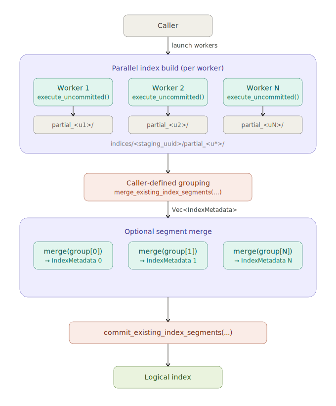

# Distributed Indexing

!!! warning
    Lance exposes public APIs that can be integrated into an external
    distributed index build workflow, but Lance itself does not provide a full
    distributed scheduler or end-to-end orchestration layer.

    This page describes the current model, terminology, and execution flow so
    that callers can integrate these APIs correctly.

## Overview

Distributed index build in Lance follows the same high-level pattern as distributed
write:

1. multiple workers build index data in parallel
2. the caller invokes Lance segment build APIs for one distributed build
3. Lance discovers the relevant worker outputs, then plans and builds index artifacts
4. the built artifacts are committed into the dataset manifest

For vector indices, the worker outputs are temporary shard directories under a
shared UUID. Internally, Lance can turn these shard outputs into one or more
built physical segments.



## Terminology

This guide uses the following terms consistently:

- **Staging root**: the shared UUID directory used during distributed index build
- **Partial shard**: one worker output written under the staging root as
  `partial_<uuid>/`
- **Built segment**: one physical index segment produced during segment build and
  ready to be committed into the manifest
- **Logical index**: the user-visible index identified by name; a logical index
  may contain one or more built segments

For example, a distributed vector build may create a layout like:

```text
indices/<staging_uuid>/
├── partial_<shard_0>/
│   ├── index.idx
│   └── auxiliary.idx
├── partial_<shard_1>/
│   ├── index.idx
│   └── auxiliary.idx
└── partial_<shard_2>/
    ├── index.idx
    └── auxiliary.idx
```

After segment build, Lance produces one or more segment directories:

```text
indices/<segment_uuid_0>/
├── index.idx
└── auxiliary.idx

indices/<segment_uuid_1>/
├── index.idx
└── auxiliary.idx
```

These physical segments are then committed together as one logical index.

## Roles

There are two parties involved in distributed indexing:

- **Workers** build partial shards
- **The caller** launches workers, chooses when a distributed build should be
  turned into built segments, provides any additional inputs requested by the
  segment build APIs, and
  commits the final result

Lance does not provide a distributed scheduler. The caller is responsible for
launching workers and driving the overall workflow.

## Current Model

The current model for distributed vector indexing has two layers of parallelism.

### Shard Build

First, multiple workers build partial shards in parallel:

1. on each worker, call an uncommitted shard-build API such as
   `create_index_builder(...).fragments(...).index_uuid(staging_index_uuid).execute_uncommitted()`
   or Python `create_index_uncommitted(..., fragment_ids=..., index_uuid=...)`
2. each worker writes one `partial_<uuid>/` under the shared staging root

### Segment Build

Then the caller turns that staging root into one or more built segments:

1. open the staging root with `create_index_segment_builder(staging_index_uuid)`
2. provide partial index metadata with `with_partial_indices(...)`
3. optionally choose a grouping policy with `with_target_segment_bytes(...)`
4. call `plan()` to get `Vec<IndexSegmentPlan>`

At that point the caller has two execution choices:

- call `build(plan)` for each plan and run those builds in parallel
- call `build_all()` to let Lance build every planned segment on the current node

After the segments are built, publish them with
`commit_existing_index_segments(...)`.

## Internal Segmented Finalize Model

Internally, Lance models distributed vector segment build as:

1. **plan** which partial shards should become each built segment
2. **build** each segment from its selected partial shards
3. **commit** the resulting physical segments as one logical index

The plan step is driven by the staging root and any additional shard metadata
required by the segment build APIs.

This is intentionally a storage-level model:

- partial shards are temporary worker outputs
- built segments are durable physical artifacts
- the logical index identity is attached only at commit time

## Segment Grouping

When Lance builds segments from a staging root, it may either:

- keep shard boundaries, so each partial shard becomes one built segment
- group multiple partial shards into a larger built segment

The grouping decision is separate from shard build. Workers only build partial
shards; Lance applies the segment build policy when it plans built segments.

## Responsibility Boundaries

The caller is expected to know:

- which distributed build is ready for segment build
- any additional shard metadata requested by the segment build APIs
- how the resulting built segments should be published

Lance is responsible for:

- writing partial shard artifacts
- discovering partial shards under the staging root
- planning built segments from the discovered shard set
- merging shard storage into built segment artifacts
- committing built segments into the manifest

This split keeps distributed scheduling outside the storage engine while still
letting Lance own the on-disk index format.
