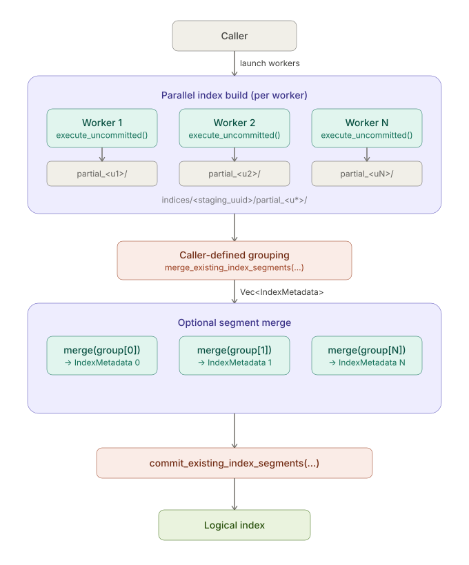

# Distributed Indexing

!!! warning
    Lance exposes public APIs that can be integrated into an external
    distributed index build workflow, but Lance itself does not provide a full
    distributed scheduler or end-to-end orchestration layer.

    This page describes the current model, terminology, and execution flow so
    that callers can integrate these APIs correctly.

## Overview

Distributed index build in Lance follows the same high-level pattern as distributed
write:

1. multiple workers build index data in parallel
2. the caller invokes Lance segment build APIs for one distributed build
3. Lance plans and builds index artifacts from the worker outputs supplied by the caller
4. the built artifacts are committed into the dataset manifest

For vector indices and segment-native scalar indices, the worker outputs are
segments stored directly under `indices/<segment_uuid>/`. Lance can turn these
outputs into one or more physical segments and then commit them as one logical
index.



## Terminology

This guide uses the following terms consistently:

- **Segment**: one worker output written by `execute_uncommitted()` under
  `indices/<segment_uuid>/`
- **Physical segment**: one index segment that is ready to be committed into
  the manifest
- **Logical index**: the user-visible index identified by name; a logical index
  may contain one or more physical segments

For example, a distributed vector build may create a layout like:

```text
indices/<segment_uuid_0>/
├── index.idx
└── auxiliary.idx

indices/<segment_uuid_1>/
├── index.idx
└── auxiliary.idx

indices/<segment_uuid_2>/
├── index.idx
└── auxiliary.idx
```

After segment build, Lance produces one or more segment directories:

```text
indices/<physical_segment_uuid_0>/
├── index.idx
└── auxiliary.idx

indices/<physical_segment_uuid_1>/
├── index.idx
└── auxiliary.idx
```

These physical segments are then committed together as one logical index. In the
common no-merge case, the input segments are already the physical
segments and can be committed directly.

## Roles

There are two parties involved in distributed indexing:

- **Workers** build segments
- **The caller** launches workers, chooses how those segments should be turned
  into final segments, optionally merges caller-defined groups, and commits the
  final result

Lance does not provide a distributed scheduler. The caller is responsible for
launching workers and driving the overall workflow.

## Current Model

The current model for distributed indexing has two layers of parallelism.

### Worker Build

First, multiple workers build segments in parallel:

1. on each worker, call a shard-build API such as
   `create_index_builder(...).fragments(...).execute_uncommitted()`
   or Python `create_index_uncommitted(..., fragment_ids=...)`
2. each worker writes one segment under `indices/<segment_uuid>/`

### Worker Shuffle Memory

Vector workers using the two-file IVF shuffler can set
`LANCE_SHUFFLE_MAX_PRELOADED_OFFSETS_BYTES` to control the maximum allocated bytes
retained for the shuffle offsets table. The default is `268435456` (256 MiB).
Set it before starting the shuffle; reopened shuffle readers also use the setting.
Values must be non-negative integers in bytes. `0` disables offset preloading;
invalid values return an error.

For example, allow up to 512 MiB per shuffle:

```shell
export LANCE_SHUFFLE_MAX_PRELOADED_OFFSETS_BYTES=536870912
```

When offsets fit, the reader can combine adjacent partitions into read windows.
If the limit is exceeded or allocation fails, the reader uses offsets from disk
and reads partitions individually. The limit applies to each shuffle, so memory
use adds up across concurrent builds. It does not include decoded data, index
construction, or other buffers, and it does not limit total process memory.

### Segment Merge

Then the caller decides whether those existing segments should be committed as-is
or merged into larger segments:

1. keep the worker outputs as-is and commit them directly with
   `commit_existing_index_segments(...)`, or
2. group one or more existing segments and call
   `merge_existing_index_segments(...)` for each caller-defined group
3. commit the final segment list with `commit_existing_index_segments(...)`

Within a single commit, built segments must have disjoint fragment coverage.

`merge_existing_index_segments(...)` currently supports vector, inverted,
bitmap, BTree, and zone map segments. Other scalar index families can still
commit multiple compatible segments directly when their build path supports
fragment-scoped segments, but cannot be merged into a larger physical segment
until they add a merge implementation.

### Vector Model Scope

Distributed vector builds support two model scopes.

**Shared model artifacts**: the caller trains or provides IVF centroids once and
passes the same artifacts to every worker. For IVF-PQ segments that should be
physically mergeable, workers should also use the same PQ codebook. This makes
partition ids and quantizer state have the same meaning across segments.

**Independent segment models**: each worker trains the IVF/PQ model for its own
`fragment_ids`. The resulting segments can be committed together as one logical
index without sharing centroids or codebooks.

At query time, Lance searches each physical segment independently:

1. Lance opens each segment by index UUID
2. each segment ranks IVF partitions using its own centroids
3. each segment searches the selected partitions using its own quantizer storage
4. Lance merges the candidate rows from all segments by `_distance`

Because partition ids are interpreted only within a segment during this fanout
query path, independently trained committed segments can return valid results.
For L2 and cosine IVF-PQ, each segment computes residuals against its own IVF
centroid during both build and query, so distances remain estimates of the
original query-to-vector metric.

Physical merge is a separate operation. It rewrites several segment artifacts
into one artifact with one model metadata scope. Use shared compatible model
artifacts for segments you plan to merge physically, or keep independently
trained segments as separate physical segments.

## Internal Finalize Model

Internally, Lance models distributed segment build as:

1. **build** one uncommitted segment per worker
2. **optionally merge** caller-defined groups of existing segments
3. **commit** the resulting segments as one logical index

The merge step is driven directly by the `IndexMetadata` returned from
`execute_uncommitted()`.

This is intentionally a storage-level model:

- segments are worker outputs that are not yet published
- physical segments are durable artifacts referenced by the manifest
- the logical index identity is attached only at commit time

## Segment Grouping

The caller chooses the final segment grouping:

- keep segment boundaries, so each worker output is committed directly
- merge multiple existing segments into a larger segment before commit

The grouping decision is separate from worker build. Workers only build
segments; Lance applies the segment build policy when it plans
physical segments.

## Distributed Index Optimization

Optimizing an index means indexing the fragments no segment covers yet and
merging that new data with some of the existing segments, so that a query
opens fewer segments. Like compaction, Lance splits this into three steps that
a caller can run on different machines: plan, execute, commit.

```text
plan     one dataset version -> independent tasks
execute  each task on a worker -> one new segment and the segments it replaces
commit   every result of the plan, together, as one manifest version
```

In Rust the entry points are `plan_index_optimization`,
`IndexOptimizeTask::execute` / `shard` / `merge` and
`commit_index_optimization` in `lance::index`. Tasks and results serialize to
JSON, so a scheduler can send them to workers and collect the results.

### Strategies

The plan is made by one of two strategies, selected through
`IndexOptimizePlanOptions`; they are mutually exclusive:

- **`DeltaMerge { num_indices_to_merge, retrain }`** reproduces what
  `optimize_indices` does in a single process: one task per index, which
  merges the most recent `num_indices_to_merge` segments with the new data.
  `retrain` and the automatic partition rebalancing of vector indices are only
  available here, and only as a single task.
- **`SizeTiered { max_rows_per_segment }`** (the default) packs the segments
  holding fewer rows than the budget, together with the new fragments, into
  bins of at most `max_rows_per_segment` rows. Every bin is one task, so one
  index's merge work runs as several tasks in parallel, and a segment at or
  above the budget is never rewritten. Vector segments are packed per shared
  model, since only segments that share IVF centroids and quantizer state can
  be merged into one; the new data joins the model of the newest segment.

Sizes come from the manifest and the deletion files alone: a segment counts
the physical rows of the live fragments it covers, a fragment its live rows.

### One task type

A task names, for one logical index, the candidate segments it may replace,
the unindexed fragments it indexes (each with its live row count) and the
merge options. Executing it runs the same merge code a single-process
optimize runs and produces one new segment plus the list of replaced
segments. Which candidates are replaced is decided while executing, by the
same rules `optimize_indices` applies.

A task marked `shardable` can have its new data built in parallel:

```text
shards = [task.shard(ids) for ids in <partition of task.fragments>]
parts  = [shard.execute(dataset) for shard in shards]      # in parallel
result = task.merge(dataset, parts)                         # one worker
```

`shard(fragment_ids)` derives a task over a subset of the fragments that
indexes them with the model of the task's last segment and replaces nothing;
`merge` re-runs the task with the shard outputs as its new data instead of
scanning the fragments. The result equals executing the task directly:
same coverage, same replaced segments, same rows per IVF partition. For HNSW
sub-indices the graph is rebuilt during the merge, so the search results may
differ in the way two builds over the same vectors do.

How the fragments are partitioned is up to the caller; the row counts on the
task are there to balance the shards (for example, the same size-based
batching an engine uses for distributed index creation). A shard's result is
itself a valid result: it can be committed without a merge, as a delta
segment, which is what a caller may do when the merge step fails. In that
case prefer shards of consecutive fragment ids, because compaction only
rewrites neighbouring fragments that the same segments cover.

Shards are available for IVF vector indices in the current (v3) format, BTree,
Bitmap, NGram and inverted indices. They are not available for a vector index that
has to be retrained or rebuilt (a dormant or definition-only segment, the
legacy IVF format), for legacy inverted segments, for the other scalar index
families, or on a table whose fragment reuse history uses the tagged format;
such tasks run as one unit.

### Commit

`commit_index_optimization` takes every result of one plan and commits one
`CreateIndex` transaction anchored at the plan's version. Results are checked
against the manifest at that version (every replaced segment exists under
the result's index name, no segment is replaced twice, the remaining coverage
does not overlap) before anything is written. What changed on the table since
the plan is handled by the commit's conflict resolution: an append or a
delete is fine, while a compaction that rewrote covered fragments, or another
optimize that replaced the same segments, is reported as a retryable
conflict, after which the caller plans again. Segments written by a plan that
is never committed are unreferenced index directories and are cleaned up
by `cleanup_old_versions(...)`.

The single-process `optimize_indices` is the same three steps in one process:
it plans with `DeltaMerge`, executes the tasks (`num_threads` at a time, one
by default) and commits their results together.

## Responsibility Boundaries

The caller is expected to know:

- which distributed build is ready for segment build
- the segment metadata returned by worker builds
- how the resulting physical segments should be published

Lance is responsible for:

- writing segment artifacts
- planning physical segments from the supplied segment set
- merging segment storage into physical segment artifacts
- committing physical segments into the manifest

If a staging root or built segment directory is never committed, it remains an
unreferenced index directory under `_indices/`. These artifacts are cleaned up
by `cleanup_old_versions(...)` using the same age-based rules as other
unreferenced index files.

This split keeps distributed scheduling outside the storage engine while still
letting Lance own the on-disk index format.
